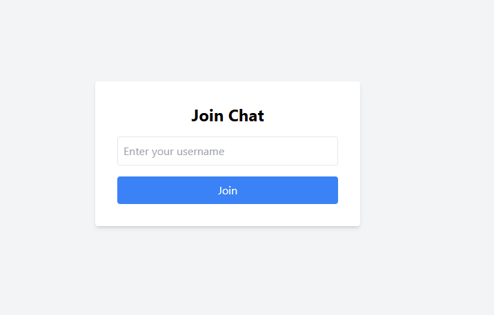
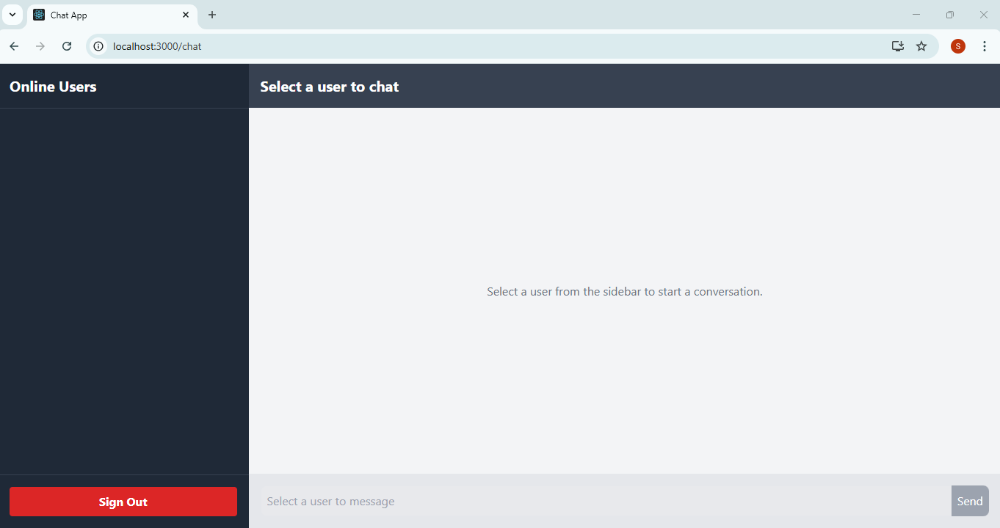
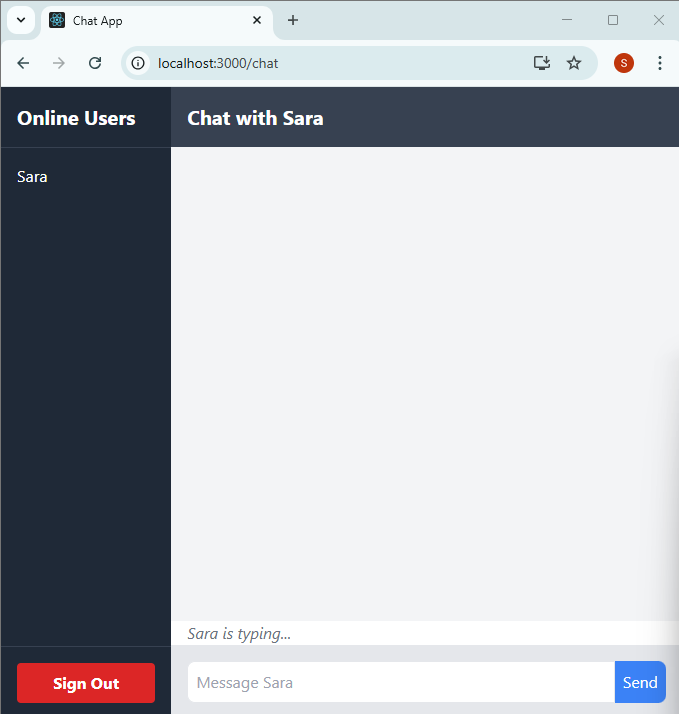
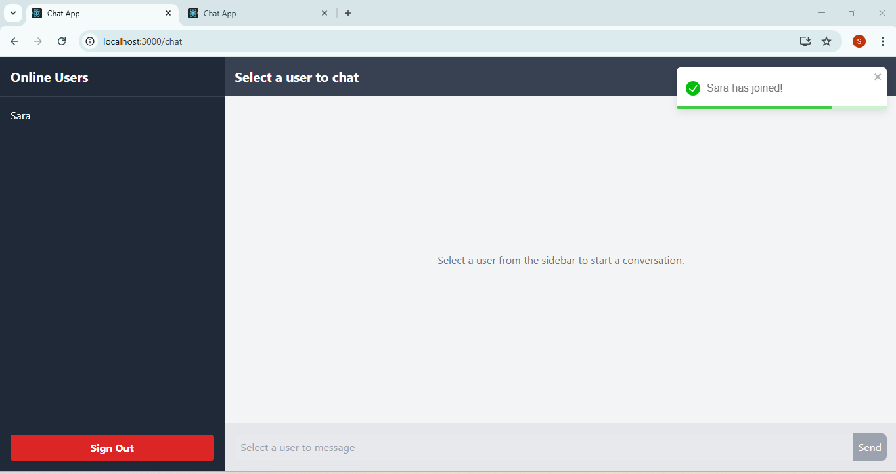
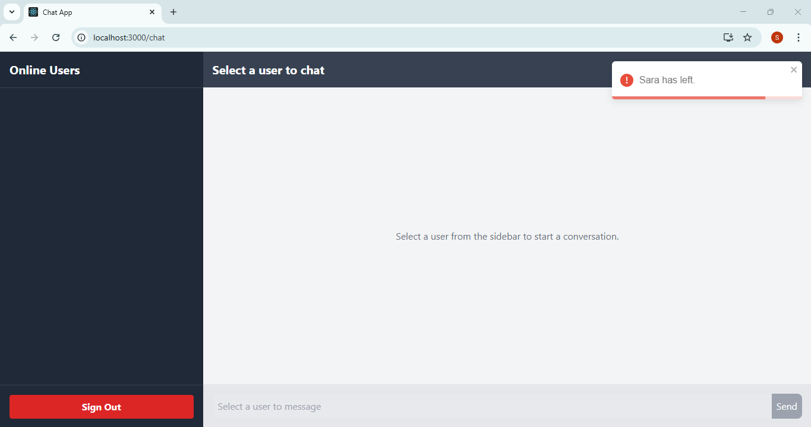

# Real-Time Chat Application

A full-stack, real-time messaging application built with the MERN stack (MongoDB, Express, React, Node.js) and Socket.IO. This project allows users to engage in private, one-on-one conversations with live user presence and persistent chat history.

**Live Demo URL:** [**https://real-time-chatting-app-alpha.vercel.app/**](https://real-time-chatting-app-alpha.vercel.app/)

---

## Project Demo

A short video demonstration of the application's features can be viewed by clicking the link below.

**[Watch the Demo Video (demo-video.mp4)](./demo-video.mp4)**

---

## Features Overview

*   **Real-time Private Messaging:** Engage in instant, one-on-one conversations with other online users without page reloads.
*   **Live User Presence:** A sidebar displays a list of all currently online users, updating instantly as users join or leave.
*   **Typing Indicators:** See a "User is typing..." notification in real-time to know when the other person is actively writing a message.
*   **Persistent Chat History:** Conversations are securely saved to a MongoDB database. When you re-open a chat, your previous message history is automatically loaded.
*   **User-Friendly Notifications:** The interface uses toast notifications to announce when a user joins or leaves the chat.

## Screenshots

| Feature | Screenshot |
| :--- | :--- |
| **Login Screen** |  |
| **Main Chat Interface** |  |
| **Typing Indicator** |  |
| **Sign-In Notification** |  |
| **Sign-Out Notification** |  |

## Tech Stack

| Component | Technology |
| :--- | :--- |
| **Frontend** | React, Socket.IO Client, TailwindCSS, React Router |
| **Backend** | Node.js, Express.js, Socket.IO, Mongoose |
| **Database** | MongoDB Atlas |

---

## Getting Started & Local Setup Instructions

Follow these instructions to get the project running on your local machine for development and demonstration.

### Prerequisites

You will need the following tools installed on your computer:

*   [Node.js](https://nodejs.org/en/) (v16 or later recommended) and npm
*   [Git](https://git-scm.com/)
*   A free [MongoDB Atlas](https://www.mongodb.com/cloud/atlas/register) account for the database.

### Installation

**1. Clone the Repository**

```bash
git clone https://github.com/your-username/your-repository-name.git
cd your-repository-name
```

**2. Backend Setup**

Navigate to the server directory, install dependencies, and create your environment file.

```bash
# Move into the server directory
cd server

# Install dependencies
npm install
```

Create a new file named `.env` in the `server` directory and add the following, replacing the placeholder with your own MongoDB connection string.

```
# File: server/.env
DATABASE_URL=mongodb+srv://<username>:<password>@cluster-address...
FRONTEND_URL=http://localhost:3000
```

Now, you can start the backend server:

```bash
# Start the server (runs on http://localhost:4000)
npm start
```

**3. Frontend Setup**

Open a **new terminal window**, navigate to the client directory from the root folder, and install its dependencies.

```bash
# Move into the client directory from the root folder
cd client

# Install dependencies
npm install
```

Create a `.env` file in the `client` directory to tell the frontend where the backend is running.

```
# File: client/.env
REACT_APP_SOCKET_URL=http://localhost:4000
```

Now, you can start the React development server:

```bash
# Start the client (opens in your browser at http://localhost:3000)
npm start
```

**4. You're All Set!**

The application is now running locally. Open `http://localhost:3000` in two separate browser windows to log in as different users and test the chat functionality.